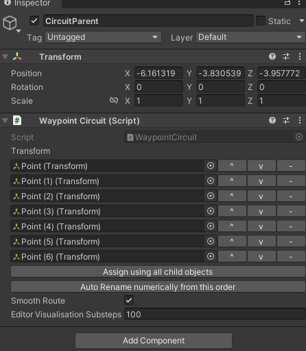
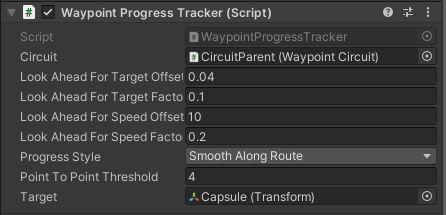
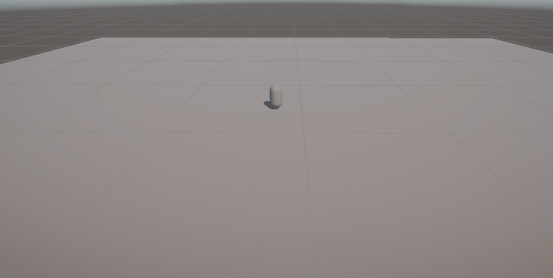

# FDV_Waypoints
Fifth exercise of Fundamentals of Video Game Development

Se importa el asset de los Waypoints de los Standard Assets.

En la escena se crea un objeto vacío y se añade un conjunto de objetos que actuarán como puntos en el mundo para los que deseamos crear el circuito. A este se le añade una script que se denomina Waypoint Circuit y se rellena la lista con los objetos puntos. Así, el objeto padre tendrá la siguiente forma:

Y para el objeto que deseamos que recorra el circuito, se le añade la script Waypoint Progress Tracker, a la cual se le indica quién es el objeto circuito anterior, y a quién afecta (el mismo jugador).

Obteniendo el siguiente resultado:

